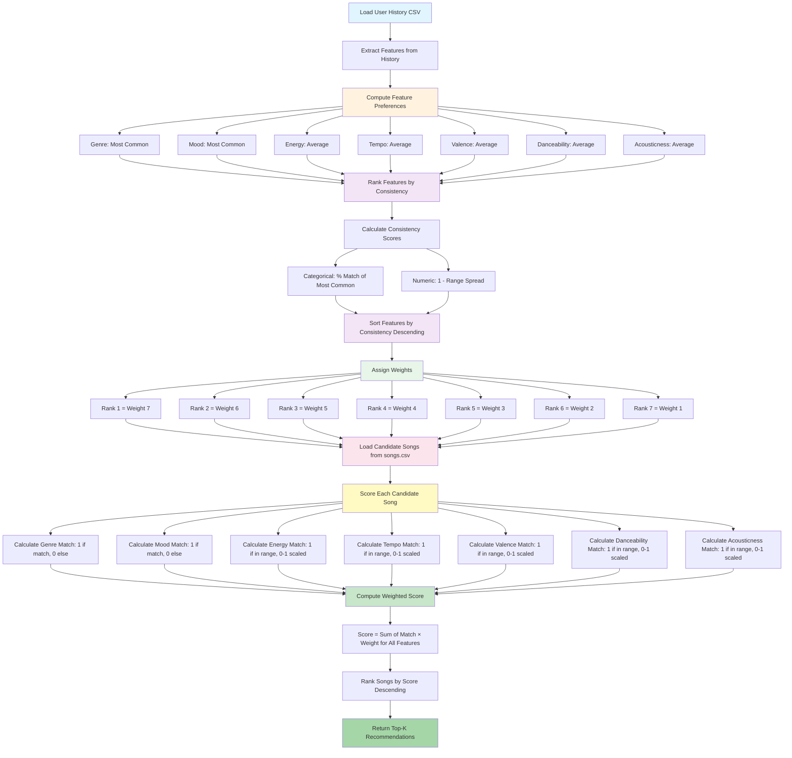

```mermaid
flowchart TD
    A["Load User History CSV"] --> B["Extract Features from History"]
    B --> C["Compute Feature Preferences"]
    C --> C1["Genre: Most Common"]
    C --> C2["Mood: Most Common"]
    C --> C3["Energy: Average"]
    C --> C4["Tempo: Average"]
    C --> C5["Valence: Average"]
    C --> C6["Danceability: Average"]
    C --> C7["Acousticness: Average"]
    
    C1 --> D["Rank Features by Consistency"]
    C2 --> D
    C3 --> D
    C4 --> D
    C5 --> D
    C6 --> D
    C7 --> D
    
    D --> E["Calculate Consistency Scores"]
    E --> E1["Categorical: % Match of Most Common"]
    E --> E2["Numeric: 1 - Range Spread"]
    
    E1 --> F["Sort Features by Consistency Descending"]
    E2 --> F
    
    F --> G["Assign Weights"]
    G --> G1["Rank 1 = Weight 7"]
    G --> G2["Rank 2 = Weight 6"]
    G --> G3["Rank 3 = Weight 5"]
    G --> G4["Rank 4 = Weight 4"]
    G --> G5["Rank 5 = Weight 3"]
    G --> G6["Rank 6 = Weight 2"]
    G --> G7["Rank 7 = Weight 1"]
    
    G1 --> H["Load Candidate Songs from songs.csv"]
    G2 --> H
    G3 --> H
    G4 --> H
    G5 --> H
    G6 --> H
    G7 --> H
    
    H --> I["Score Each Candidate Song"]
    I --> I1["Calculate Genre Match: 1 if match, 0 else"]
    I --> I2["Calculate Mood Match: 1 if match, 0 else"]
    I --> I3["Calculate Energy Match: 1 if in range, 0-1 scaled"]
    I --> I4["Calculate Tempo Match: 1 if in range, 0-1 scaled"]
    I --> I5["Calculate Valence Match: 1 if in range, 0-1 scaled"]
    I --> I6["Calculate Danceability Match: 1 if in range, 0-1 scaled"]
    I --> I7["Calculate Acousticness Match: 1 if in range, 0-1 scaled"]
    
    I1 --> J["Compute Weighted Score"]
    I2 --> J
    I3 --> J
    I4 --> J
    I5 --> J
    I6 --> J
    I7 --> J
    
    J --> K["Score = Sum of Match × Weight for All Features"]
    K --> L["Rank Songs by Score Descending"]
    L --> M["Return Top-K Recommendations"]
    
    style A fill:#e1f5ff
    style C fill:#fff3e0
    style D fill:#f3e5f5
    style F fill:#f3e5f5
    style G fill:#e8f5e9
    style H fill:#fce4ec
    style I fill:#fff9c4
    style J fill:#c8e6c9
    style M fill:#a5d6a7
```
